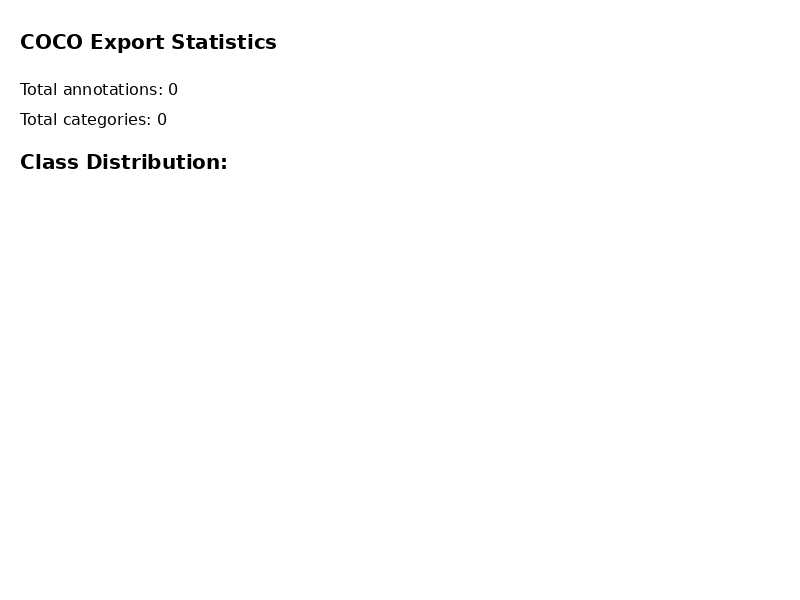
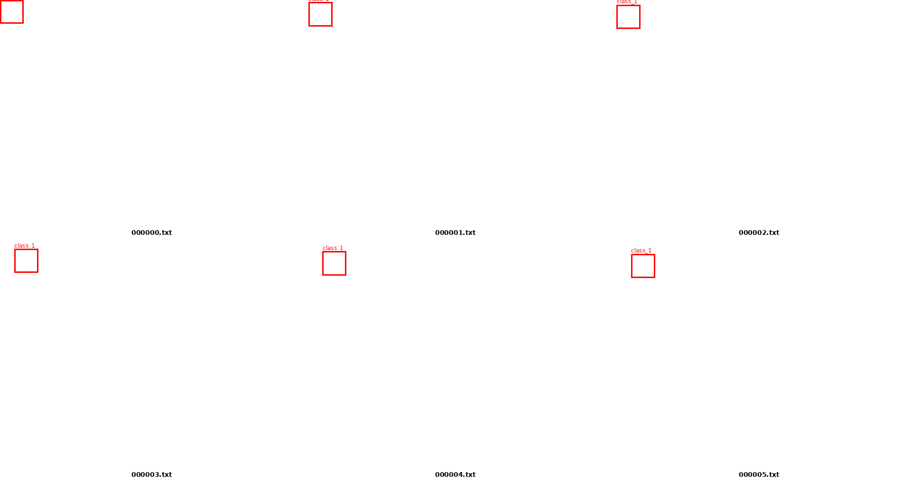

# KomanSim

A lightweight, swappable-backend **synthetic data generation platform** for robotics. Generate reproducible, labeled datasets from configurable templates with support for multiple physics simulators.



## Copy/Paste Quickstart

```bash
git clone https://github.com/uptonow/KomanSim.git
cd KomanSim
python3 -m venv .venv
source .venv/bin/activate  # On Windows: .venv\Scripts\Activate.ps1
pip install -e ".[dev]"
komansim run --backend dummy --config examples/configs/job_dummy_coco.yaml
```

**Output location:** `outputs/demo_job/` contains RGB images, annotations, COCO/YOLO exports, and `manifest.json`.

```
outputs/demo_job/
├── rgb/              # RGB images (PNG)
├── annotations.jsonl # Canonical annotations
├── exports/
│   ├── coco.json     # COCO format export
│   └── yolo/         # YOLO format export
└── manifest.json     # Dataset metadata with hashes
```

## Quick Start

```bash
# Install
python3 -m venv .venv
source .venv/bin/activate  # On Windows: .venv\Scripts\Activate.ps1
pip install -e ".[dev]"

# Validate demo config
komansim validate examples/configs/job_dummy_coco.yaml

# Run a demo job (dummy backend - no dependencies)
komansim run --backend dummy --config examples/configs/job_dummy_coco.yaml

# Use caching to avoid redundant generation
komansim run --backend dummy --config examples/configs/job_dummy_coco.yaml --cache
```

**Expected result:** The command generates:
- `outputs/demo_job/` directory with RGB images, annotations, and exports
- `outputs/demo_job/exports/coco.json` - COCO format export
- `outputs/demo_job/manifest.json` - Dataset metadata with `jobspec_hash` and `dataset_hash`
- `outputs/demo_job.zip` - Packaged dataset archive (created at `{out_dir}.zip`)

Output goes to `outputs/<job_name>/` with RGB images, annotations, and a packaged dataset archive.

## YOLO Demo (Ultralytics)



Generate an Ultralytics-compatible YOLO dataset:

```bash
# Validate YOLO demo config
komansim validate examples/configs/job_dummy_yolo.yaml

# Run YOLO demo job (dummy backend - no dependencies)
komansim run --backend dummy --config examples/configs/job_dummy_yolo.yaml
```

**Output location:** `outputs/demo_job_yolo/exports/yolo/` contains the Ultralytics-compatible dataset structure:

```
outputs/demo_job_yolo/exports/yolo/
├── dataset.yaml      # Ultralytics dataset configuration
├── images/
│   ├── train/        # Training images (80% split)
│   └── val/          # Validation images (20% split)
└── labels/
    ├── train/        # Training labels (*.txt)
    └── val/          # Validation labels (*.txt)
```

**Generate demo visualization:**
```bash
python scripts/make_demo_assets_yolo.py --dataset_yaml outputs/demo_job_yolo/exports/yolo/dataset.yaml --out docs/assets/demo_yolo_result.png
```

**Optional Ultralytics sanity check:**
```bash
pip install ultralytics
yolo detect train data=outputs/demo_job_yolo/exports/yolo/dataset.yaml model=yolov8n.pt imgsz=640 epochs=1
```

## Features

- **Multiple backends**: Dummy, MuJoCo, PyBullet, Isaac Sim (experimental/untested)
- **Automatic labeling**: Bounding boxes, instance segmentation
- **Standard exports**: COCO, YOLO formats
- **Dataset registry & caching**: Track and reuse generated datasets
- **Reproducibility**: Config hashing, manifest generation, seed tracking
- **Validation**: Backend/asset format validation, resource limits
- **Python SDK**: Programmatic API for integration into your workflows

### Status

**✅ Works now:**
- Dummy backend (no dependencies, generates placeholder data)
- COCO and YOLO export formats
- Manifest generation with `jobspec_hash` and `dataset_hash`
- Config validation and asset format checking
- QA output generation (when real backends are used)
- Dataset registry and caching

**🧪 Experimental/Untested:**
- Isaac Sim backend (Linux only; requires proprietary runtime)

**🗺️ Planned:**
- Dataset diff / HTML report generation

## Backends

| Backend | Dependencies | Asset Format | Platform |
|---------|-------------|--------------|----------|
| **Dummy** | None | Any (placeholders) | All |
| **MuJoCo** | `pip install mujoco` | `.mjcf`, `.xml` | All |
| **PyBullet** | `pip install pybullet` | `primitive://box`, `primitive://sphere` | All |
| **Isaac Sim** (experimental/untested) | Isaac Sim installation | `.usd`, `.usda`, `.usdc` | Linux only (proprietary runtime) |

## CLI Commands

**Note:** The `simdata` command is deprecated but still works (prints a deprecation warning). Please use `komansim` instead.

### Main Commands
- `komansim init <path>` - Generate starter config
- `komansim validate <path>` - Validate job config
- `komansim run --backend <name> --config <path> [--cache]` - Run generation job

### Dataset Management
- `komansim datasets list` - List all datasets
- `komansim datasets show <dataset_id>` - Show dataset details
- `komansim datasets find --config <path>` - Find datasets by config
- `komansim datasets cleanup` - Remove orphaned entries
- `komansim datasets clear` - Clear registry

## Example Config

```yaml
job_name: demo_job
out_dir: outputs/demo_job
backend: dummy  # Optional: dummy | mujoco | pybullet | isaac_sim (experimental)
seed: 0
num_frames: 20
dt: 0.0333333
headless: true
width: 640
height: 480

scene:
  usd_path: null
  physics_dt: 0.0166667
  dome_light_intensity: 1500.0

assets:
  - name: obj_01
    usd_path: "primitive://box"
    semantic_label: "object"
    scale: 1.0

sensors:
  - name: cam0
    type: camera_rgb
    pose:
      p: [1.5, 1.5, 1.2]
      q: [0.0, 0.0, 0.0, 1.0]
    intrinsics:
      fx: 500
      fy: 500
      cx: 320
      cy: 240

randomization:
  random_xy: 0.2
  random_yaw_deg: 180.0
```

## Output Structure

```
outputs/
├── <job_name>/       # Output directory
│   ├── rgb/          # RGB images (PNG)
│   ├── depth/        # Depth maps (if enabled)
│   ├── seg/          # Segmentation masks (if enabled)
│   ├── meta/         # Frame metadata JSON files
│   ├── annotations.jsonl # Canonical annotation JSONL
│   ├── exports/      # COCO/YOLO exports
│   │   ├── coco.json # COCO format export
│   │   └── yolo/     # YOLO format export
│   ├── previews/     # Preview images for QA
│   ├── qa.json       # Quality assurance metrics
│   └── manifest.json # Dataset metadata (includes jobspec_hash and dataset_hash)
└── <job_name>.zip    # Packaged dataset archive (sibling of output directory)
```

The package archive is created at `{out_dir}.zip` (sibling of the output directory) by default.

## Python SDK

The `komansim` package provides a simple SDK for programmatic usage:

**Note:** The `simdata` package is deprecated but still works (prints a deprecation warning). Please use `komansim` instead.

### `validate_config(path_or_dict) -> JobConfig`

Validate a job configuration file or dictionary.

```python
from komansim import validate_config

config = validate_config("examples/configs/job_dummy_coco.yaml")
# Returns: JobConfig object
```

### `run(path_or_dict, backend: str, cache: bool=True, out_dir: Path|None=None, seed: int|None=None) -> RunResult`

Run a synthetic data generation job.

```python
from komansim import run
from pathlib import Path

result = run(
    "examples/configs/job_dummy_coco.yaml",
    backend="dummy",
    cache=True,
    out_dir=Path("outputs/my_job"),
    seed=42
)

# result.dataset_id: Unique dataset identifier
# result.package_path: Path to the packaged dataset archive
# result.cache_hit: Whether this was a cache hit
```

### `stats(out_dir: Path) -> dict`

Get statistics and metadata from a generated dataset.

```python
from komansim import stats
from pathlib import Path

stats_dict = stats(Path("outputs/my_job"))
# Returns: dict with keys like 'num_frames', 'dataset_hash', 'jobspec_hash', etc.
```

## Documentation

- **[Complete User Guide](docs/USER_GUIDE.md)** - Comprehensive guide with all features, examples, and workflows
- **[Architecture](docs/20-engineering/architecture.md)** - System design and backend contract
- **[JobSpec Reference](docs/20-engineering/jobspec.md)** - Configuration schema
- **[Local Registry & Caching](docs/20-engineering/local-registry-caching.md)** - Dataset registry details
- **[Exporters & Packaging](docs/20-engineering/exporters-packaging.md)** - Export formats
- **[Troubleshooting](docs/20-engineering/troubleshooting.md)** - Common issues and solutions

See [docs/README.md](docs/README.md) for the full documentation index.

## Development

```bash
# Run tests
pytest tests/

# Check code style
ruff check komansim/
```

### Regenerating Demo Assets

**COCO demo:**
```bash
# Run the demo (if not already done)
komansim run --backend dummy --config examples/configs/job_dummy_coco.yaml

# Generate the visualization
python scripts/make_demo_assets.py --annotations outputs/demo_job/exports/coco.json --out docs/assets/demo_result.png
```

**YOLO demo:**
```bash
# Run the demo (if not already done)
komansim run --backend dummy --config examples/configs/job_dummy_yolo.yaml

# Generate the visualization
python scripts/make_demo_assets_yolo.py --dataset_yaml outputs/demo_job_yolo/exports/yolo/dataset.yaml --out docs/assets/demo_yolo_result.png
```

## Known Limitations

- **Multi-sensor output**: Currently optimized for single-camera workflows
- **Backend availability**: MuJoCo and PyBullet require optional dependencies. Isaac Sim backend is experimental/untested and requires proprietary runtime (Linux only)

## Supported Python Versions

- Python 3.10+
- Tested on Python 3.10 and 3.11

## License

Apache-2.0

See [LICENSE](LICENSE) file for details.
